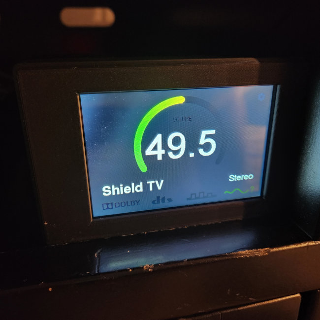
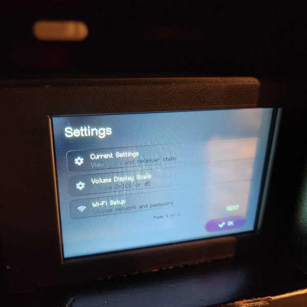

# Marantz Volume Monitor v2

A modern, touchscreen-based volume monitor for Marantz home theater receivers, powered by an ESP32 and a 4" SPI TFT display.

## Features

- **Wi-Fi Connectivity:** No more Ethernet cables; connects directly to your home network.
- **4" Touchscreen:** Large, high-contrast display with a modern Dark Mode UI and an enlarged Home Screen source label for distance readability.
- **Polling Home Status:** Roughly once-per-second updates for the Home Screen volume, input source, and audio mode.
- **Interactive UI:** Touch-driven configuration menus for Wi-Fi and Receiver setup.
- **Auto-Discovery:** SSDP support to find your Marantz receiver on the network automatically.

## Hardware Requirements

- **Microcontroller:** Elegoo ESP32 DevKit V1
- **Display:** 4" SPI TFT Touchscreen (ST7796 Driver)
- **Power:** 5V 2A power supply (via USB-C or VIN)

Refer to [`docs/hardware.md`](docs/hardware.md) for detailed wiring, power, and touch calibration notes.

I [included the 3D models for the box I made, too](./assets/box/README.md), if you want to use that.

## Software Setup

This project uses [PlatformIO](https://platformio.org/) for development and [Spec Kit](https://github.com/tillig/speckit) for project management.

1. Install [VS Code](https://code.visualstudio.com/) and the [PlatformIO extension](https://marketplace.visualstudio.com/items?itemName=platformio.platformio-ide).
2. Clone this repository.
3. Open the project folder in VS Code.
4. PlatformIO will automatically download the required libraries.
5. Build the firmware with `platformio run`.
6. Upload the firmware to the ESP32 with PlatformIO's upload action or `platformio run --target upload`.

## Configuration

Upon first boot, use the on-screen menus to:

1. Connect to your Wi-Fi network.
2. Select your Marantz receiver with auto-discovery or enter its IPv4 address manually.

After setup, tap the small gear icon in the top-right corner of the Home Screen to reopen Settings. Settings provides a read-only `Current Settings` overview, a `Volume Display Scale` setting, Wi-Fi setup, receiver setup, touch calibration, and `Reset To Defaults`. Use the Settings OK button to return to the Home Screen.

- `Current Settings` shows the saved Wi-Fi SSID, live monitor IP address and signal strength when Wi-Fi is connected, the saved receiver IP address, current receiver power state, and receiver identity when it can be resolved from UPnP device metadata.
- `Volume Display Scale` lets you choose whether the Home Screen number shows the normalized `0.0` to `100.0` scale used by the firmware (`receiver dB + 80`) or the raw receiver `dB` value. The gauge always stays on the normalized scale.
- `Wi-Fi Setup` lets you scan for a Wi-Fi network or enter network information manually.
- `Receiver Setup` lets you scan for a Marantz receiver on the local network via SSDP/UPnP multicast. You may also manually enter your receiver IP address. If a receiver is not discovered, confirm the ESP32 and receiver are on the same subnet and that the router allows multicast between clients. Standby discovery may also require the receiver's network/IP control standby setting to be enabled.
- `Touch Calibration` lets you manually calibrate your touch screen for improved precision. The firmware ships with a measured default affine profile for the canonical hardware build, so a fresh device remains usable even if calibration has never been run. Use this if the touch accuracy feels off.

If you need to recover from a bad saved profile or clear setup state, open `Settings` > `Reset To Defaults`, choose `Wi-Fi`, `Receiver`, or `Calibration`, then confirm with `Reset`.

If the receiver is reachable but powered off, the Home Screen shows `Receiver off` instead of the last live volume. Both powered-off and unavailable receiver states keep the top-right Settings path available so Wi-Fi or receiver setup can be reopened without restarting the device. When powered-off status remains confirmed, `Receiver off` stays visible for about 3 seconds and then the Home Screen blanks to a quiet black screen until the receiver becomes active again or the screen is long-tapped (hold down for a second). A wake tap only restores the Home Screen; opening Settings still requires a separate tap on the visible gear icon.

## Project Structure

- `src/ui`: UI management and screen implementations.
- `src/network`: Wi-Fi management and Marantz API client.
- `src/storage`: Persistent configuration storage using LittleFS.
- `docs/`: Durable hardware, UI, and architecture reference documentation.
- `specs/`: Spec Kit feature definitions, plans, contracts, quickstarts, and tasks.
- `.specify/`: Spec Kit configuration, templates, scripts, constitution, and extensions.

For build, validation, and contribution workflow details, see [`CONTRIBUTING.md`](./CONTRIBUTING.md).

## License

This project is licensed under the MIT License - see the [`LICENSE`](./LICENSE) file for details.
