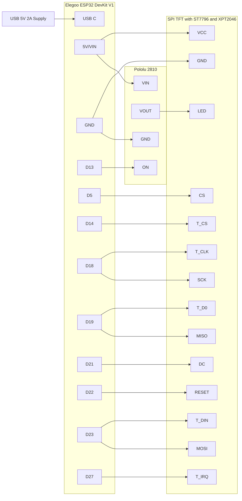

# Hardware Reference

- [Canonical Build](#canonical-build)
- [Bill Of Materials](#bill-of-materials)
- [Power](#power)
- [Display, Touch, and Backlight Wiring](#display-touch-and-backlight-wiring)
- [Wiring Validation](#wiring-validation)
- [Touch Calibration](#touch-calibration)

## Canonical Build

This project is built around one canonical hardware configuration:

- Elegoo ESP32 DevKit V1 (`ESP32-WROOM-32`)
- 4" 480x320 SPI TFT with ST7796 controller
- XPT2046 touch controller
- Pololu Mini MOSFET Slide Switch LV, item `2810`, for TFT backlight control
- One 5V 2A USB power supply connected to the ESP32

The firmware drives ESP32 GPIO13 as the backlight-control signal. When the receiver is confirmed off, Home shows `Receiver off` for about 3 seconds, clears the display, then turns off the TFT `LED/BL` backlight through the Pololu switch. TFT logic, touch, ESP32 power, receiver polling, and touch wake remain active.

## Bill Of Materials

| Qty | Part                                                                                   | Purpose                        | Notes                                                        |
| --- | -------------------------------------------------------------------------------------- | ------------------------------ | ------------------------------------------------------------ |
| 1   | [Elegoo ESP32 DevKit V1](https://amzn.to/4xneYUJ)                                      | Main controller                | ESP32 3.3V GPIO logic. Not 5V tolerant.                      |
| 1   | 4" SPI TFT with ST7796 and XPT2046                                                     | Display and touch              | Uses shared SPI wiring for TFT and touch.                    |
| 1   | [Pololu Mini MOSFET Slide Switch LV, item `2810`](https://www.pololu.com/product/2810) | High-side TFT backlight switch | Use the board's labeled `VIN`, `VOUT`, `ON`, and `GND` pads. |
| 1   | [5V 2A USB power supply](https://amzn.to/4vOVJ4Z)                                      | Power input                    | Connect to ESP32 USB only.                                   |
| 3-5 | 22-26 AWG hookup wires or Dupont jumpers                                               | Wiring                         | For ESP32 power, ground, GPIO13, and `LED/BL`.               |
| 1   | Multimeter                                                                             | Validation                     | Required for continuity and voltage checks.                  |

## Power

The monitor uses one 5V 2A USB supply plugged into the ESP32. Display power, touch power, and the backlight-switch load path are all sourced from ESP32 power pins after USB power enters the ESP32.

All components must share ground. Before accepting the build, confirm the ESP32-fed 5V path remains stable with the display active:

- USB input stays near 5V without ESP32 brownouts.
- Voltage between TFT `VCC` and `GND` stays at least 4.75V while the display is active.
- The ESP32 USB connector, `5V`/`VIN` pin, jumpers, and switch module do not become uncomfortably warm after 10 minutes.

## Display, Touch, and Backlight Wiring

The display and touch controller share the ESP32 VSPI pins, and the TFT `LED/BL` line is routed through the Pololu 2810.

> :warning: Note some pins have multiple connections - power, clock, MISO, MOSI. As long as they all connect _somehow_ you should be OK. For example, I connected T_CLK => SCK on the display component, then connected SCK to the ESP32 D18. It made the display-to-ESP32 wiring easier.

| Connection        | ESP32 Pin Label | GPIO | Destination    | Purpose                             |
| ----------------- | --------------- | ---- | -------------- | ----------------------------------- |
| Power             | `VIN`           | 5V   | TFT `VCC`      | Main power for display logic        |
| Backlight source  | `VIN`           | 5V   | Pololu `VIN`   | Switched backlight source input     |
| Ground            | `GND`           | GND  | TFT `GND`      | Shared ground                       |
| Shared ground     | `GND`           | GND  | Pololu `GND`   | Shared reference for switch control |
| Chip select       | `D5`            | 5    | TFT `CS`       | Display chip select                 |
| Backlight control | `D13`           | 13   | Pololu `ON`    | Firmware backlight command          |
| Touch chip select | `D14`           | 14   | Touch `T_CS`   | Touch chip select                   |
| SPI clock         | `D18`           | 18   | TFT `SCK`      | Display SPI clock                   |
| Touch clock       | `D18`           | 18   | Touch `T_CLK`  | Touch clock, shared SPI             |
| SPI MISO          | `D19`           | 19   | TFT `MISO`     | Display SPI MISO                    |
| Touch MISO        | `D19`           | 19   | Touch `T_DO`   | Touch MISO, shared SPI              |
| Data/command      | `D21`           | 21   | TFT `DC`       | Display data or command select      |
| Reset             | `D22`           | 22   | TFT `RESET`    | Display reset                       |
| SPI MOSI          | `D23`           | 23   | TFT `MOSI`     | Display SPI MOSI                    |
| Touch MOSI        | `D23`           | 23   | Touch `T_DIN`  | Touch MOSI, shared SPI              |
| Touch interrupt   | `D27`           | 27   | Touch `T_IRQ`  | Touch interrupt, optional           |
| Backlight output  | Pololu `VOUT`   | 5V   | TFT `LED/BL`   | Switched TFT backlight feed         |

Canonical wiring diagram:

The Pololu board has duplicate `VIN`, `VOUT`, and `GND` pads that share the same node. Use the pad positions that make the wiring cleanest.

## Wiring Validation

With USB disconnected:

1. Confirm TFT `VCC` is connected to ESP32 `5V`/`VIN`.
2. Confirm Pololu `VIN` is connected to ESP32 `5V`/`VIN`.
3. Confirm Pololu `VOUT` is connected only to TFT `LED/BL`.
4. Confirm GPIO13 is connected to Pololu `ON`.
5. Confirm ESP32, TFT, and Pololu share ground.

Then power the ESP32 by USB:

1. Confirm the display powers up normally and touch remains responsive.
2. Turn the receiver off and confirm `Receiver off` appears before the backlight turns off after about 3 seconds.
3. Tap the dark display and confirm the backlight turns on and the wake tap does not open Settings.
4. While blanked, turn the receiver active and confirm live volume returns without reboot.

## Touch Calibration

Touch alignment on this hardware uses a measured 9-point affine transform in `src/ui/TouchManager.*`. Simple axis min/max calibration plus manual per-screen offsets was not accurate enough for the keyboard and list screens.

`XPT2046_Touchscreen::setRotation(1)` already rotates controller readings to match the display orientation. If alignment drifts, use the `Calibrate` button on the unconfigured/setup Home Screen to capture a new 9-point dataset from the serial console, then update the affine coefficients in `TouchManager`. Do not add screen-specific hitbox offsets unless new hardware data proves the affine model is wrong.
