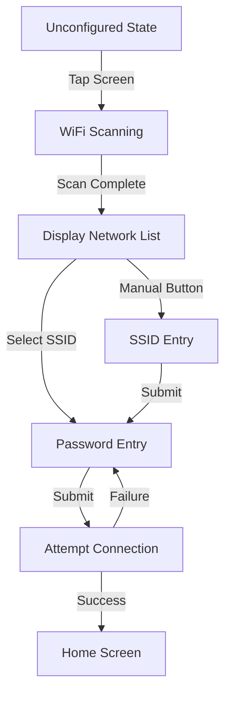

# Data Model: WiFi Setup UI

## Entities

### WiFiNetwork (In-Memory)

Represents a network discovered during a scan.

| Field | Type | Description |
| :--- | :--- | :--- |
| ssid | String | Service Set Identifier |
| rssi | int32_t | Signal strength in dBm |
| encryptionType | uint8_t | WiFi security type (WPA2_PSK only for v2) |

### NetworkCredentials (Persistent)

Stored in `config.json` via `LittleFS`.

| Field | Type | Validation |
| :--- | :--- | :--- |
| wifiSsid | String | 1-32 chars |
| wifiPassword | String | 8-63 chars (for WPA2) |

## State Transitions

