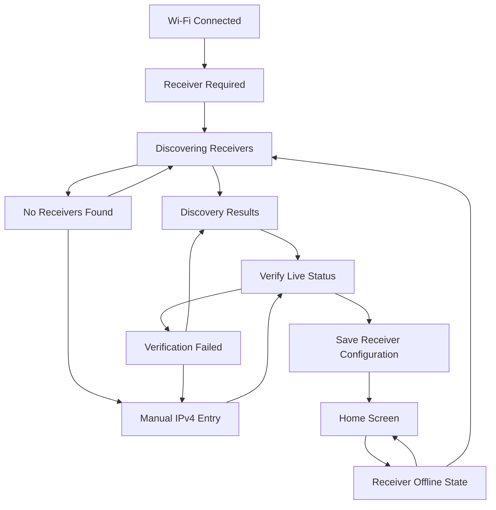

# Data Model: Receiver Detection and Configuration

## Entities

### ReceiverCandidate (In-Memory)

Represents a compatible receiver discovered during SSDP/UPnP search.

| Field | Type | Validation |
| :--- | :--- | :--- |
| name | String | Required for display; fallback to "Unknown Receiver" if advertisement omits a friendly name |
| ipAddress | String | Required IPv4 address |
| source | enum | `Discovered` or `Manual` |
| discoveredAtMs | uint32_t | Monotonic timestamp used to age discovery results |

### ReceiverConfiguration (Persistent)

Stored as part of `config.json` via LittleFS.

| Field | Type | Validation |
| :--- | :--- | :--- |
| receiverIp | String | IPv4 address; saved only after live status verification succeeds |

### VerificationResult (In-Memory)

Represents the outcome of testing a selected or manually entered receiver.

| Field | Type | Validation |
| :--- | :--- | :--- |
| success | bool | True only when live receiver status is returned |
| ipAddress | String | Candidate IPv4 address tested |
| statusValid | bool | Mirrors live status validity from `MarantzClient` |
| failureReason | enum | `None`, `InvalidAddress`, `Timeout`, `NoStatus`, `NetworkUnavailable`, `SaveFailed` |

## Validation Rules

- Manual entry must contain exactly four IPv4 octets.
- Each IPv4 octet must be numeric and within `0-255`.
- Empty, malformed, hostname, URL, and custom-port input must be rejected before verification.
- Discovery results must be deduplicated by IPv4 address.
- A receiver candidate can be saved only after verification returns live receiver status.
- Failed replacement verification must not overwrite an existing `receiverIp`.

## State Transitions

## Relationships

- `ReceiverCandidate.ipAddress` becomes `ReceiverConfiguration.receiverIp` only after successful verification.
- `VerificationResult` is transient and must not be persisted.
- `DeviceConfig` continues to own Wi-Fi settings, brightness, scale preference, and receiver IP as one persisted configuration record.
